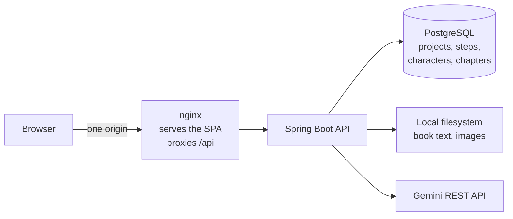

<div align="center">

# Book Illustrator

**Turn a book's text into character portraits and a chapter illustration, one deliberate step at a time.**

Java · Spring Boot · PostgreSQL · React · TypeScript · Gemini API

[Quick start](#quick-start) · [How it works](#how-it-works) · [Architecture](#architecture) · [Testing](TESTING.md) · [Decisions](DECISIONS.md)

</div>

---

Paste a book. Run five steps at your own pace and watch each result land: an art style, the
main characters, their portraits, a chapter prompt, and the finished scene.

Nothing runs on its own. Every result is saved the moment it arrives. Close the tab
mid-generation and reopen it a day later, and the project picks up exactly where it stopped
without paying for the same step twice.

```
Style  ──▶  Characters  ──▶  Portraits  ──▶  Chapter prompts  ──▶  Illustrations
 text          text            image             text                  image
```

## What it does well

| | |
|---|---|
| **You hold the trigger** | Every step waits for an explicit click, so a project costs exactly what you asked for. No background workers, no surprise spend. |
| **Never runs twice** | Acquiring a step is a conditional `UPDATE` in Postgres. A double click, a refresh, or a second tab loses the race and is shown the run already in flight. |
| **Survives everything** | Refresh, sign out, restart the server mid-call: the project reports its true state on reopen, down to how long the current step has been running. |
| **Fails usefully** | A failed step keeps everything generated before it, records why in plain language, and retries alone. |
| **Never gets stuck** | A run that outlives the 120-second lock is reclaimed by the next attempt from the UI. No database surgery, no support ticket. |
| **Costs are bounded** | Two characters and one chapter per project, enforced server-side, including across retries. |

## Quick start

**You need:** Docker with Compose, and your own [Gemini API key](https://ai.google.dev/gemini-api/docs).
No local JDK, Maven or Node: everything builds and tests inside containers.

```bash
git clone https://github.com/DuyNguyen-3006/book-illustrator.git
cd book-illustrator
./start.sh
```

First run creates `backend/.env` and `frontend/.env` from their examples, then brings up
Postgres, the API and the UI.

**Add your key to `backend/.env` before running a pipeline step:**

```env
GEMINI_API_KEY=your-key-here
```

Open **<http://localhost:5173>** and sign in with any name and email. There is no password:
a new email starts an account, a known one loads its projects.

```bash
./test.sh    # backend suite against a real Postgres, then the frontend suite
```

> **On image quota.** Steps 3 and 5 call an image model, and the free tier's image
> allowance is small and easy to exhaust. When it runs out, every Nano Banana model answers
> `429` until it resets, and the Imagen models answer `404 no longer available to new
> users`. All five steps have been run end to end against a real key; if step 3 or 5 says
> "The AI service is busy", that is the quota talking, not the app.

## How it works

| # | Step | Produces | Model |
|---|---|---|---|
| 1 | **Style** | An art style, either yours or one the model derives from the book | text |
| 2 | **Characters** | Up to 2 adult characters, each with an image prompt | text |
| 3 | **Portraits** | One portrait per character, in the established style | image |
| 4 | **Chapter prompts** | One chapter scene, referencing the characters by name | text |
| 5 | **Illustrations** | The scene, drawn with the portraits attached so faces stay consistent | image |

The book is uploaded **once**. Every later text step chains off the previous interaction id
rather than resending the book, and the image steps carry the portraits they need directly.
That is the notebook's mechanism, verified over REST by this app.

## Architecture



The browser only ever talks to one origin, so the session cookie is first-party and the
backend carries no CORS configuration at all. In development the Vite proxy plays nginx's
part.

**Backend** — Clean Architecture, enforced by a test rather than by convention:

```
interfaces/rest  →  application (use cases, output ports)  →  domain (entities, enums)
infrastructure   →  implements the ports: Postgres, Gemini REST, local files
```

`domain` imports no Spring. Controllers reach infrastructure only through use cases.
`ArchitectureTest` (ArchUnit) fails the build when that stops being true. Full rules in
[`docs/architecture.md`](docs/architecture.md).

**Frontend** — feature-sliced React:

```
src/features/<domain>/{components,pages,hooks,services,types}
src/shared/{components,lib,types}   src/router   src/config   src/components/ui
```

TanStack Query owns server state, including polling a running step and stopping the moment
it finishes. One module knows the response envelope; no screen branches on the shape of a
response.

## Tech stack

| Layer | Choice | Why |
|---|---|---|
| Backend | Java 21, Spring Boot 3.3 | Fast to move in, boring in the good way |
| Database | PostgreSQL 16, Flyway | Real transactions and a real conditional `UPDATE` for the step lock |
| Frontend | React 19, Vite, TypeScript | Matches the reference scope |
| Server state | TanStack Query | Polling, dedupe and cache invalidation without hand-rolled timers |
| Styling | Tailwind v3, Lightswind components | Design tokens in one place, components owned in-repo |
| Tests | JUnit + Mockito + ArchUnit, Vitest + Testing Library | 137 backend, 46 frontend |
| Deployment | Docker Compose, local only | The assessment forbids a public deployment |

## Repository map

| Path | What |
|---|---|
| [`backend/`](backend) | Spring Boot service, Flyway migrations, tests |
| [`frontend/`](frontend) | React app, nginx config, tests |
| [`docs/architecture.md`](docs/architecture.md) | Backend architecture, written before the code followed it |
| [`docs/tasks.md`](docs/tasks.md) | Task list, mirroring GitHub Issues |
| [`DECISIONS.md`](DECISIONS.md) | Why things are the way they are, including where the AI was overruled |
| [`TESTING.md`](TESTING.md) | What is tested, what deliberately is not, and a real run |
| [`CLAUDE.md`](CLAUDE.md), [`.claude/`](.claude) | The AI working contract and its skills |

## Environment variables

| Variable | File | Purpose |
|---|---|---|
| `GEMINI_API_KEY` | `backend/.env` | Your own key. Git-ignored; `.env.example` is what ships. |
| `POSTGRES_DB` / `POSTGRES_USER` / `POSTGRES_PASSWORD` | `backend/.env` | Database credentials, also read by the Postgres container |
| `PORT` | `backend/.env` | API port, default `8080` |
| `STORAGE_ROOT` | `backend/.env` | Where book text and images are written; Compose points it at a volume so they survive a rebuild |
| `VITE_API_BASE_URL` | `frontend/.env` | Dev-server proxy target only; in containers nginx handles it |

## Known limitations

- **Image quota.** Steps 3 and 5 depend on the free tier's image allowance (see above).
- **Sessions are in-memory.** Restarting the backend signs users out. Pipeline state is
  untouched and the UI sends them back to sign in.
- **Local only**, by the assessment's instruction. Do not deploy this publicly with a real
  key.
